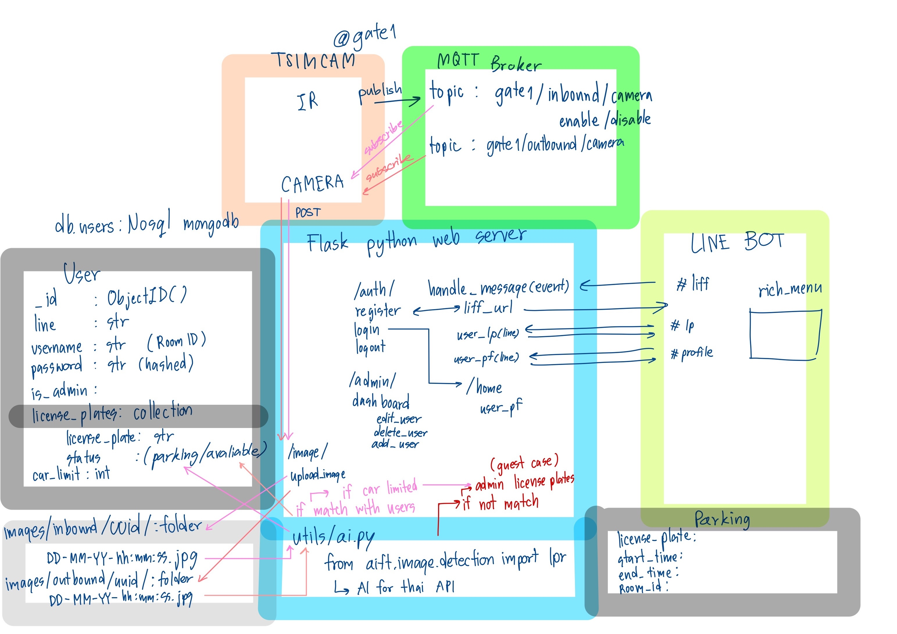

# Mini-project: ระบบไม้กั้นสำหรับที่จอดรถอัตโนมัติด้วย LINE Bot

Due December 29, 2024 11:59 PM

Instructions

>ทำ clip + github อธิบายระบบที่เป็น full-stack IoT
> - ฮาร์ดแวร์ = microcontroller สามารถแจ้งได้ว่าอยากใช้เซ็นเซอร์แบบไหน
> - Docker = MQTT + REST API + database
> - LINE bot + LIFF API

# ระบบไม้กั้นสำหรับที่จอดรถอัตโนมัติด้วย LINE Bot

## Backgrounds

ระบบจอดรถสำหรับที่พักอาศัยในปัจจุบัน โดยทั่วไปมีการใช้งานอุปกรณ์ 2 อย่างคือ

- ตัวส่งสัญญาณเปิดไม้กั้น : สำหรับเปิดไม้กั้นด้วยตนเอง
- สติกเกอร์ : สำหรับตรวจสอบจำนวนรถที่มีสิทธิในการจอดรถ ที่ในท้ายที่สุดต้องใช้พนักงานเข้าไปตรวจสอบที่ลานจอดรถโดยตรง

อย่างไรก็ตาม ด้วยระบบการทำงานนี้ มีความซ้ำซ้อนและไม่สะดวกสบายในการใช้งานเป็นอย่างมากในกรณีที่ ผู้พักอาศัยมีการเปลี่ยนรถบ่อย หรือทำสติกเกอร์ และตัวส่งสัญญาณสูญหายบ่อยครั้ง

## Importances

หากสามารถสร้างระบบที่สามารถ

1. ลงทะเบียนรถสำหรับการจอดได้อัตโนมัติ ผ่าน Line bot แทนการย้ายสติกเกอร์จากรถคันหนึ่งไปอีกคันหนึ่ง
2. ลดปัญหาอุปกรณ์สูญหาย และชำรุดของผู้พักอาศัย โดยใช้งานกล้องสำหรับตรวจสอบป้ายทะเบียนที่ลงทะเบียนไว้
3. ตรวจสอบข้อมูลย้อนหลังได้ผ่าน LIFF (Line Frontend Framwork)

## Requirements

- ในฐานะ user, ฉันไม่ต้องการพบ สติกเกอร์ และตัวส่งสัญญาณเปิดไม้กั้นในทุกครั้งที่เข้าจอดรถ, ดังนั้นฉันจึงใช้ระบบไม้กั้นอัตโนมัติที่ใช้กล้องเพื่อจดจำป้ายทะเบียนแล้วทำการตรวจสอบสิทธิการจอดรถโดยอัตโนมัติ
- ในฐานะ user, ฉันต้องการเพิ่ม/ลบ ป้ายทะเบียนสำหรับการเข้าจอดรถโดยไม่ต้องติดต่อนิติกรที่เปิดทำการเฉพาะในเวลา, ดังนั้นฉันจึงใช้ Line Bot เพื่อดู/เพิ่ม/ลบ ป้ายทะเบียนของฉันด้วยคำสั่ง #lp list, #lp add <plate_number>, และ #lp remove <plate_number>
- ในฐานะ user, ฉันต้องการตรวจสอบจำนวนสิทธิในการเข้าจอดรถของฉัน, ดังนั้นฉันจึงใช้ Line Bot เพื่อตรวจสอบ profile ของฉันด้วยคำสั่ง #profile
- ในฐานะ user, ฉันต้องการทราบว่ามีการเข้าจอดรถด้วยสิทธิของฉัน, ดังนั้นฉันจึงติดตาม Line Bot เพื่อรอรับการแจ้งเตือนการเข้า และ ออกจากลานจอดรถ
- ในฐานะ user, ฉันต้องการใช้งาน การเพิ่ม/ลบ ป้ายทะเบียนผ่าน UI, ดังนั้นฉันจึงใช้ LIFF เพื่อเพิ่ม/ลบ ป้ายทะเบียนของฉัน
- ในฐานะ admin, ฉันต้องการช่วยเหลือ user ในการจัดการกับ profile, ดังนั้นชั้นจึง login ด้วย admin และ เพิ่ม/ลบ/แก้ไข profile ของ user ผ่าน dashboard
- ในฐานะ admin, ฉันต้องการเพิ่มสิทธิให้ admin คนใหม่, ดังนั้นชั้นจึง login ด้วย admin และ แก้ไข profile ของ user ผ่าน dashboard
- ในฐานะ admin, ฉันต้องการจัดการกับป้ายทะเบียนในระบบ, ดังนั้นชั้นจึง login ด้วย admin และ แก้ไข profile ของ user ผ่านหน้า home
- ในฐานะ admin, ฉันต้องการเข้าตรวจสอบการเข้าจอดรถของ user, ดังนั้นชั้นจึง login ด้วย admin และตรวจสอบผ่านหน้า history
- ในฐานะ แขกชาวต่างชาติที่เข้าจอดรถชั่วคราว ที่ไม่ต้องการใช่้งาน LINE application, ฉันต้องการใช้งานระบบจอดรถโดยไม่ต้อง download line application, ดังนั้นฉันจึง สมัครบัญชีผ่าน web application แล้วรอให้ admin เพิ่มสิทธิเข้าจอดรถ

## Overview

Demo Clip: https://youtu.be/O1CW4Y6Mj5U

