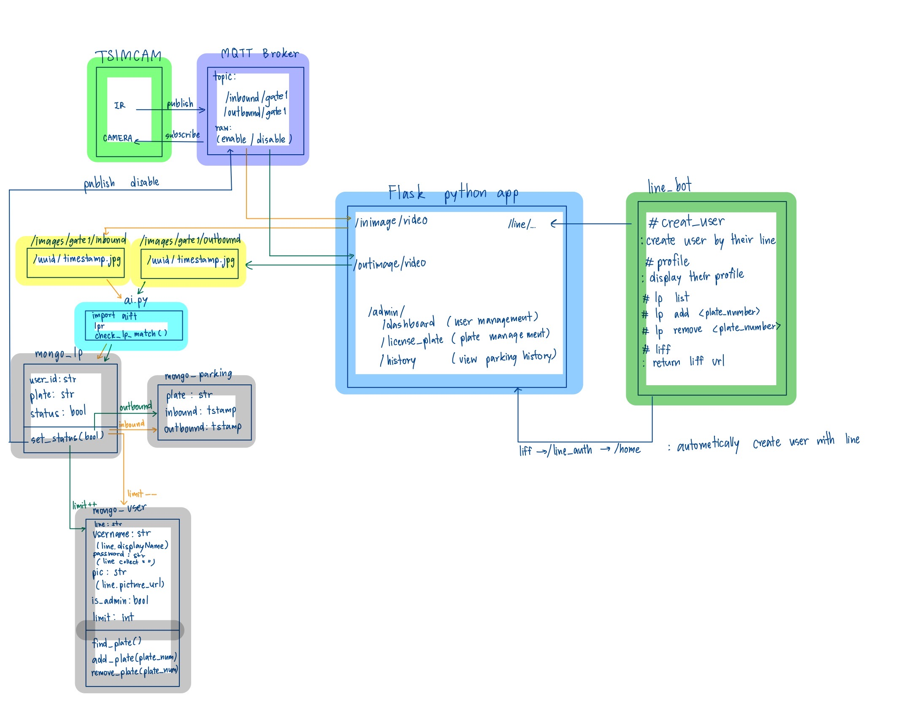

# Mini-project: ระบบไม้กั้นสำหรับที่จอดรถอัตโนมัติด้วย LINE Bot

Due December 29, 2024 11:59 PM

Instructions

>ทำ clip + github อธิบายระบบที่เป็น full-stack IoT
> - ฮาร์ดแวร์ = microcontroller สามารถแจ้งได้ว่าอยากใช้เซ็นเซอร์แบบไหน
> - Docker = MQTT + REST API + database
> - LINE bot + LIFF API

# ระบบไม้กั้นสำหรับที่จอดรถอัตโนมัติด้วย LINE Bot

## Backgrounds

ระบบจอดรถสำหรับที่พักอาศัยในปัจจุบัน โดยทั่วไปมีการใช้งานอุปกรณ์ 2 อย่างคือ

- ตัวส่งสัญญาณเปิดไม้กั้น : สำหรับเปิดไม้กั้นด้วยตนเอง
- สติกเกอร์ : สำหรับตรวจสอบจำนวนรถที่มีสิทธิในการจอดรถ ที่ในท้ายที่สุดต้องใช้พนักงานเข้าไปตรวจสอบที่ลานจอดรถโดยตรง

อย่างไรก็ตาม ด้วยระบบการทำงานนี้ มีความซ้ำซ้อนและไม่สะดวกสบายในการใช้งานเป็นอย่างมากในกรณีที่ ผู้พักอาศัยมีการเปลี่ยนรถบ่อย หรือทำสติกเกอร์ และตัวส่งสัญญาณสูญหายบ่อยครั้ง

## Importances

หากสามารถสร้างระบบที่สามารถ

1. ลงทะเบียนรถสำหรับการจอดได้อัตโนมัติ ผ่าน Line bot แทนการย้ายสติกเกอร์จากรถคันหนึ่งไปอีกคันหนึ่ง
2. ลดปัญหาอุปกรณ์สูญหาย และชำรุดของผู้พักอาศัย โดยใช้งานกล้องสำหรับตรวจสอบป้ายทะเบียนที่ลงทะเบียนไว้
3. ตรวจสอบข้อมูลย้อนหลังได้ผ่าน LIFF (Line Frontend Framwork)

## Overview

